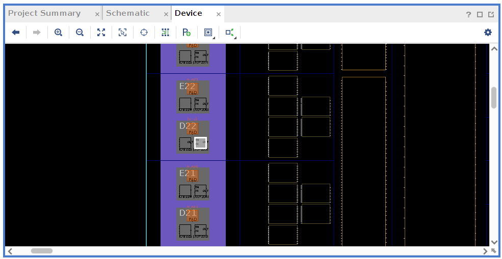
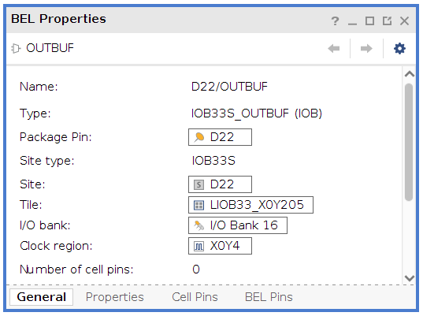

# Porting guidelines

This page describes steps you need to take in order to incorporate this
HyperRAM controller into your design.

The Example Design uses the Artix 7 FPGA from Xilinx.  However, the controller
has been written in pure RTL (i.e. as portable as possible), making use of only
rising edge flip flops and no other IP blocks. It should therefore be a
relatively easy task to port this project to other FPGAs, even other vendors as
well, e.g. Lattice or Intel.

When porting the HyperRAM controller to your own project, there are three key
points to consider:

* Tri-state buffering
* Clocking
* Constraints


## Tri-state buffering

The HyperRAM device uses bidirectional ports, and this requires I/O buffers
with tri-state capability for the wires `RWDS` and `DQ`. Vivado can
automatically infer tri-state buffers when assigning `'Z'` to a port declared
as `inout`.  It is good design practice to infer the tri-state buffers from the
top-level file. Therefore, this HyperRAM controller does not itself infer any
tri-state buffers. Instead, it contains three signals for each of the `RWDS` and
`DQ` wires: One for input, one for output, and one for output enable.

In the top-level file of your own project you should include the following lines:

```
hr_rwds_io <= hr_rwds_out when hr_rwds_oe = '1' else 'Z';
hr_dq_io   <= hr_dq_out   when hr_dq_oe   = '1' else (others => 'Z');
hr_rwds_in <= hr_rwds_io;
hr_dq_in   <= hr_dq_io;
```

Here `hr_rwds_io` and `hr_dq_io` are the external ports connected to the HyperRAM
device.


## Clocking

The HyperRAM implementation requires a total of three clocks:

* `clk_i`        : This runs at 100 MHz, and drives the Avalon MM interface as
  well as the HyperRAM speed.
* `clk_x2_i`     : This runs at 200 Mhz and must be synchronous to `clk_i` with
  no phase shift.
* `clk_x2_del_i` : This runs at 200 Mhz and must be synchronous to `clk_i` with
  a specific phase shift.

All three clocks should be generated from the same MMCM/PLL.

The reason for the phase-shifted clock is to ensure correct timing when
sampling the input date `DQ` from the HyperRAM. For more information, see
[Detailed design description](src/hyperram/README.md#hyperram_io.vhd).

The specific value of the phase shift for `clk_x2_del_i` is board and device
dependent. To determine the value to use probably requires some hand tuning,
i.e. experimentally trying different values to find a range where there are no
errors.

On the MEGA65 platform I've had success with phase shifts in the range 144 to
180 degrees, and have therefore settled on the central value of 162 degrees.

See the file [src/Example_Design/clk.vhd](src/Example_Design/clk.vhd) for how
clock synthesis is done on the MEGA65.


## Constraints

My experiments have shown that the HyperRAM timing is very sensitive to
variations in design placement within the FPGA. Incorrect or sub-optimal
placement can lead to large routing delays inside the FPGA that can interfere
with the HyperRAM timing.  Therefore it is necessary to constrain the design so
that the HyperRAM controller is placed as close to the I/O pads as possible.
I've found it sufficient to control the placement of the output register for
the `CK` signal to the HyperRAM, i.e. the register `hr_ck_o_reg` in the file
`hyperram_io.vhd`.

On the MEGA65 the `CK` signal is connected to pin D22, which is in the upper
left corner of the FPGA. The closest I/O pad is at X=0 and Y=205 (see below for
further details). Therefore, for the MEGA65 I've added the following
constraint:

```
set_property LOC SLICE_X0Y205 [get_cells -hier hr_ck_o_reg]
```

With this single constraint Vivado consistently places the HyperRAM controller
right next to the corresponding I/O ports.

There are other means of coercing Vivado to place the HyperRAM controller
correctly, e.g. by setting appropriate input and output delays, but I was not
successfull with that approach.

### Locating the I/O pad

To determine the correct constraint to use I first located the I/O pin D22 in
the device view in Vivado:



Then selecting the pin and viewing the pin properties gives this result:



From the line "Tile:" we directly see the value X=0 and Y=205.

